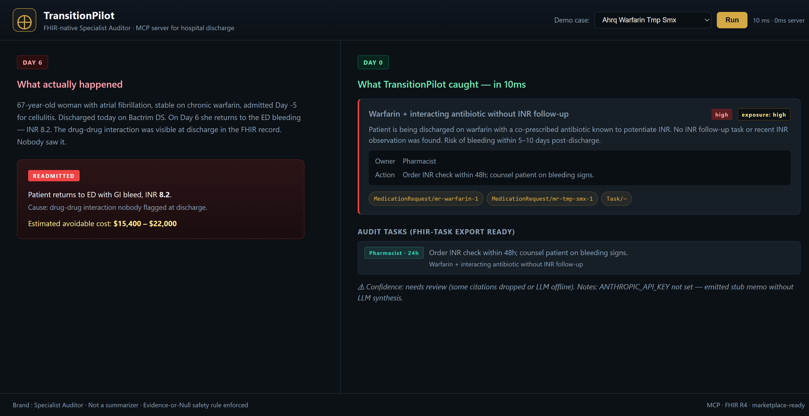
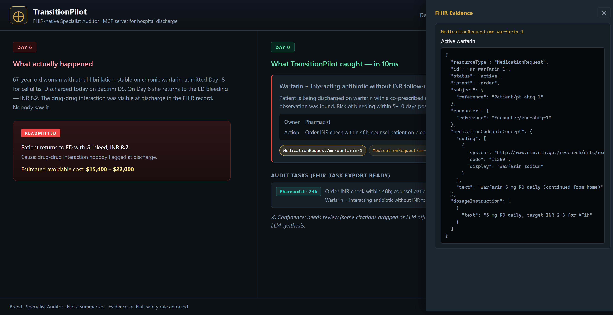
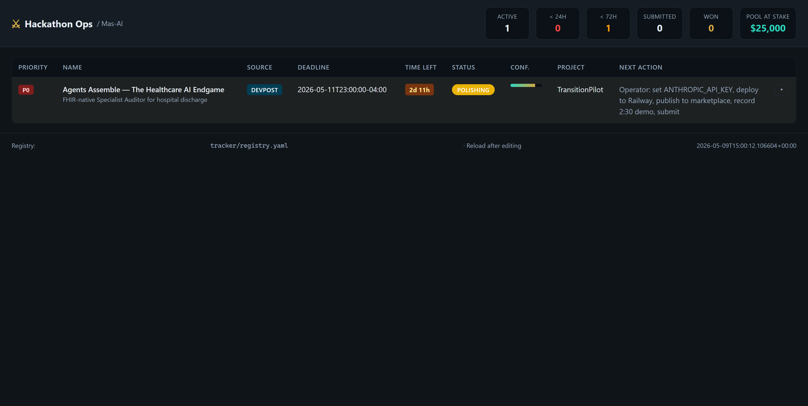

# TransitionPilot

> **FHIR-native Specialist Auditor for hospital discharge.**
> Not a summarizer. Not a chatbot. An auditor that catches the discharge failures
> nobody flagged — and proves it with clickable FHIR provenance.



| Memo result | Evidence panel | Tracker dashboard |
|---|---|---|
|  |  |  |

**Demo video:** [v0.1.0-demo release →
demo-captioned.mp4](https://github.com/Masoud-Masoori/transition-pilot/releases/download/v0.1.0-demo/demo-captioned.mp4)
(32 seconds, captions burned in).

## Live demo

- **Live MCP server:** https://tires-roberts-containers-landscape.trycloudflare.com
- **Interactive demo UI:** https://tires-roberts-containers-landscape.trycloudflare.com/demo/ui/

```bash
curl -X POST https://tires-roberts-containers-landscape.trycloudflare.com/demo/run \
  -H "Content-Type: application/json" \
  -d '{"case_id": "ahrq_warfarin_tmp_smx"}'
```

## What it does

Given a patient's FHIR R4 bundle at discharge time, TransitionPilot returns a
**Discharge Failure Prevented memo** — a one-screen, CIO-shippable artifact with:

- **Failures prevented** — high-risk patterns found (drug interactions, duplicate
  opioids, insulin without monitoring, HF without follow-up, allergy conflicts)
- **Logic-Link evidence** — every recommendation cites the specific FHIR resource ID
  that drove it (click any badge to see the raw JSON)
- **Audit tasks** — actionable items mapped to FHIR Task export, with owner and SLA
- **Reconciled medication table** — continue / held / new / stopped, each row with
  FHIR provenance
- **Patient-friendly instructions** — plain English, optional Spanish caregiver
  translation
- **Exposure band** — coarse financial-impact label (low / medium / high) per
  failure, no false precision

The headline branding promise: **"Specialist Auditor, not generalist summarizer."**

## Why this can't be a chatbot

Discharge medication errors are the leading cause of post-discharge adverse drug
events. AHRQ data: ~700,000 ED visits and 100,000 hospitalizations per year.
Most of those failures are visible in the FHIR record at discharge time —
they're just not being read in time, by the right person, with the right context.

TransitionPilot's structural contribution is the **Evidence-or-Null safety rule**:
every clinical recommendation MUST cite a FHIR resource ID present in the bundle,
or it is labeled `Provider-Directed (No FHIR Link Found)` rather than invented.
This eliminates AI hubris — the failure mode that loses clinician judges.

## Architecture

```
Clinician → Prompt Opinion platform → BYO agent → TransitionPilot MCP server
                                                         │
                              ┌──────────────────────────┼──────────────────────────┐
                              ▼                          ▼                          ▼
                       FHIR R4 fetcher           Deterministic engine         Claude Haiku 4.5
                       (parallel asyncio)        (5 hard-coded patterns)      (synthesis only,
                                                                              Evidence-or-Null)
                              │                          │                          │
                              └──────────────┬───────────┴──────────────────────────┘
                                             ▼
                                  Discharge Failure Prevented memo
                                  + FHIR Tasks + patient instructions
                                  + Logic-Link evidence map
```

The deterministic engine is the **spine** that makes the demo reliable: the LLM
never invents the findings. The LLM only writes the human-language wrapper around
findings already detected by rule.

## The 5 hard-coded high-risk patterns

| Pattern | Trigger | Default owner |
|---|---|---|
| Anticoagulant + interacting antibiotic | warfarin + (TMP-SMX, cipro, metronidazole, fluconazole) without INR follow-up Task or recent INR Observation | Pharmacist |
| Duplicate opioid | ≥2 active opioid MedicationRequest at discharge | Hospitalist |
| Insulin without glucose monitoring | active insulin without recent glucose Observation or fingerstick Task | RN |
| Heart failure no follow-up | Condition I50.* + recent inpatient Encounter + no Appointment in next 14 days | Care Coordinator |
| Allergy conflict | active MedicationRequest where ingredient (or class via cross-class table) matches AllergyIntolerance | Pharmacist |

All 5 pattern detectors are unit tested. See `tests/test_reconciliation.py`.

## Quick start (local)

```bash
# 1. Clone & install
cd code/transition-pilot
python -m venv .venv
.venv/Scripts/python.exe -m pip install -e .

# 2. Set Anthropic key for full LLM synthesis (optional — will run in stub mode without)
cp .env.example .env
# edit .env, set ANTHROPIC_API_KEY=sk-ant-...

# 3. Run server
python -m transition_pilot.server   # serves on http://127.0.0.1:8089

# 4. Open the demo
# Browser → http://127.0.0.1:8089/demo/ui/
# Pick a case → Run → click any Logic-Link badge to see the FHIR evidence
```

## API

### `POST /tools/build_transition_packet`

The MCP-compatible production endpoint. Headers come from the platform's FHIR
context plumbing:

```
X-FHIR-Server-URL: https://...prompt-opinion.../api/workspaces/<id>/fhir
X-FHIR-Access-Token: Bearer ...
X-Patient-Id: <patient FHIR id>
```

Body (JSON):

```json
{ "patient_id": "optional", "instruction_style": "patient_friendly" }
```

Returns `TransitionResponse` (see `schemas.py`):

```json
{
  "memo": {
    "patient_id": "...",
    "failures_prevented": [...],
    "medication_changes": [...],
    "audit_tasks": [...],
    "clinician_summary_markdown": "...",
    "patient_instructions_markdown": "...",
    "patient_instructions_es_markdown": "...",
    "confidence_label": "evidence_grounded"
  },
  "timing": {"fetch_ms": 850, "total_ms": 4120},
  "used_evidence_or_null_fallback": false
}
```

### `POST /demo/run`

Local-dev / demo flavor. Loads one of `cases/*.json` and runs the same pipeline.
Used by the demo UI.

```json
{ "case_id": "ahrq_warfarin_tmp_smx" }
```

### `GET /demo/cases`

Lists available demo case IDs.

### `GET /demo/cases/{id}.json`

Returns raw FHIR bundle for the case — used by the evidence panel.

### `GET /demo/ui/`

Serves the split-screen demo viewer.

## Tests

```bash
.venv/Scripts/python.exe -m pytest tests/ -v
```

11 reconciliation tests cover: each pattern firing on its target case, each
pattern NOT firing on the wrong case, full-bundle dispatch, and the Logic-Link
non-empty invariant.

## Deploy

`deploy/Dockerfile` and `deploy/railway.json` are configured for one-command
Railway deploys. See `deploy/README.md`.

## Demo cases included

| Case ID | Pattern triggered | Story |
|---|---|---|
| `ahrq_warfarin_tmp_smx` | Warfarin + interacting antibiotic | Modeled on AHRQ WebM&M anticoagulation cases — 67yo F discharged on warfarin + Bactrim DS, returns Day 6 with INR 8.2 |
| `case_2_duplicate_opioid` | Duplicate opioid | Post-op patient on oxycodone + hydromorphone simultaneously |
| `case_3_insulin_no_glucose` | Insulin without monitoring | T2DM patient newly on insulin glargine, no glucose Task |
| `case_4_hf_no_followup` | HF without follow-up | HFrEF discharged with no 14-day appointment |
| `case_5_allergy_conflict` | Allergy/medication conflict | Penicillin-allergic patient discharged on amoxicillin |

## What this is NOT

- Not a CDS replacement. It's a transition-of-care safety net.
- Not a substitute for a clinician's review. The memo is `evidence_grounded` or
  `needs_review` — never "approved."
- Not a multi-agent orchestration framework. Single MCP server, single Haiku call,
  one deterministic rule engine. Boring on purpose; reliable on purpose.

## License

AGPL-3.0-or-later. The same fighter-brand license Mas-AI uses for Daena OSS.

## Built for

Devpost "Agents Assemble — The Healthcare AI Endgame," May 2026.
Strategy locked via 3-way LLM council debate (Codex VC + Contrarian + Gemini
clinician — 3-of-3 convergence on "Specialist Auditor" framing).
